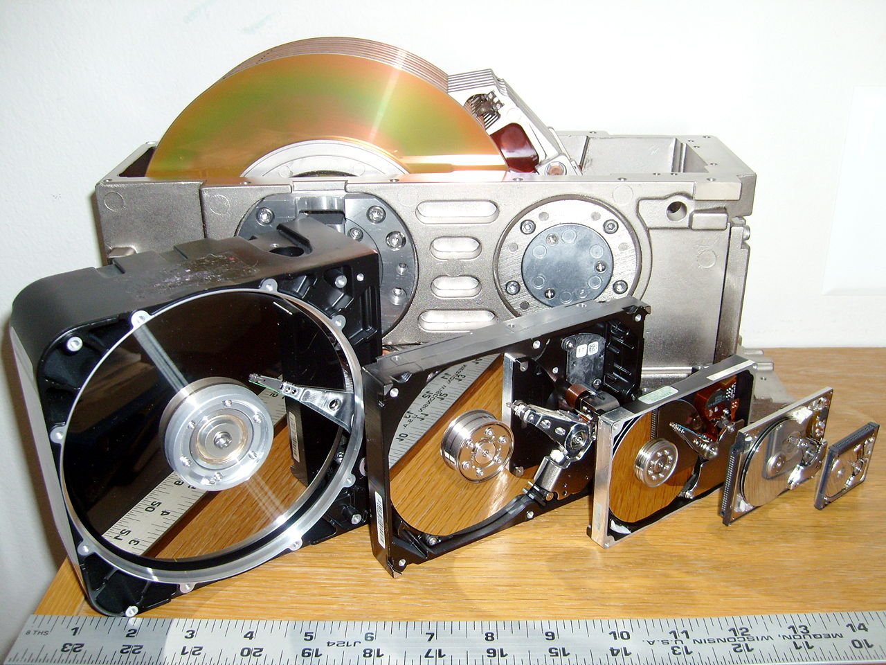

# Storage | Linux | Quickstarts

## Install Debian on a USB
Download: 
https://www.debian.org/download

To have support for non-free firmware: 
https://cdimage.debian.org/cdimage/unofficial/non-free/cd-including-firmware/11.4.0-live+nonfree/amd64/iso-hybrid/


```bash
lsblk
# or
sudo fdisk --list
```
Make sure it is umount first. Some Linux distros might auto-mount: 
```bash
sudo umount /dev/sdx1
```

```bash
sudo dd bs=4M if=/path/to/debian-10.0.0-amd64-netinst.iso of=/dev/sdx status=progress oflag=sync
```

## :copyright: Copyright
- [1280px-SixHardDriveFormFactors.jpg](https://en.wikipedia.org/wiki/Hard_disk_drive#/media/File:SixHardDriveFormFactors.jpg)
