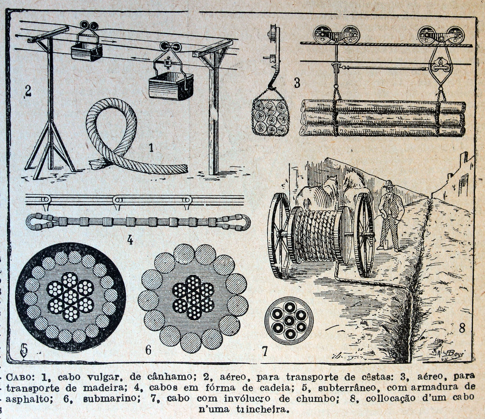

# Intercommunication | Linux | Quickstarts

## ©️ Copyright
- "<a rel="noopener noreferrer" href="https://www.flickr.com/photos/37667416@N04/5240400033">&#039;Cabo&#039;</a>" by <a rel="noopener noreferrer" href="https://www.flickr.com/photos/37667416@N04">Biblioteca Rector Machado y Nuñez</a> is marked with <a rel="noopener noreferrer" href="https://creativecommons.org/publicdomain/mark/1.0/?ref=openverse">Public Domain Mark 1.0 </a>.

## :scroll: License

The license for the code and documentation can be found in the [LICENSE](./LICENSE) file.

---

Made in Québec 🏴󠁣󠁡󠁱󠁣󠁿, Canada 🇨🇦!
