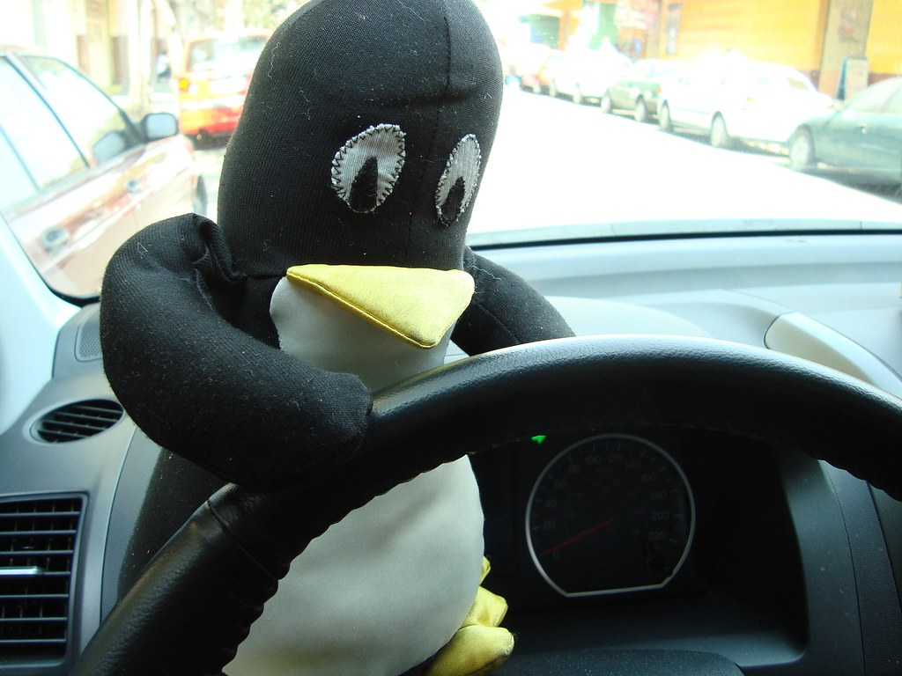

# Device Drivers | Module | Linux | Quickstarts

## Command list
- `ioctl` - control device

## Resources
- [A Tutorial how to get started with Linux Kernel Modules and Linux Drivers | GitHub](https://github.com/jnbdz/Linux_Driver_Tutorial)
- [How to Write a Device Driver for Video Cameras | linuxtoday.com](https://www.linuxtoday.com/blog/linux-camera-driver-tutorial/)
- [How to Write Linux Mouse Drivers | linuxtoday.com](https://www.linuxtoday.com/blog/linux-mouse-drivers/)
- [Enabling Support for Your (Webcam) Hardware in Linux | tldp.org](https://tldp.org/HOWTO/Webcam-HOWTO/hardware.html)
- [Writing camera sensor drivers | kernel.org](https://www.kernel.org/doc/html/latest/driver-api/media/camera-sensor.html)
- [The Soc-Camera Drivers | kernel.org](https://www.kernel.org/doc/html/v4.9/media/v4l-drivers/soc-camera.html)

## Credits
- [Image - Tux nov2011 - juanvc](https://wordpress.org/openverse/image/76c306a6-62a6-4136-acf2-c20aede48a29)
