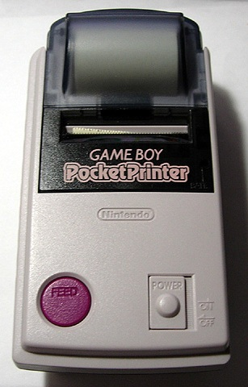

# Printers | Linux | Quickstarts

## Resources
- [CUPS | Wikipedia](https://en.wikipedia.org/wiki/CUPS)
- [CUPS.org](https://www.cups.org/)
- [How to install and configure printers on Kali Linux | Medium](https://subba-lakshmi.medium.com/how-to-install-and-configure-printers-on-kali-linux-78a0476b3cfe)
- [Printing | debian.org](https://wiki.debian.org/Printing)
- [OpenPrinting CUPS | GitHub.io](https://openprinting.github.io/cups/)
- [Printing from the Linux command line | Network World](https://www.networkworld.com/article/3373502/printing-from-the-linux-command-line.html)
- [Tips for using the Ip command to print from Linux systems | Network World](https://www.networkworld.com/article/3378024/tips-and-tricks-for-using-the-ip-command-to-print-from-linux-systems.html)
- [Printing from the Linux Command Line - Linux.com](https://www.linux.com/training-tutorials/printing-linux-command-line/)
- [Linux printing made easy, Part 3 | Computerworld](https://www.computerworld.com/article/2798448/linux-printing-made-easy--part-3.html)
- [OpenPrinting | GitHub.io](https://openprinting.github.io/)
