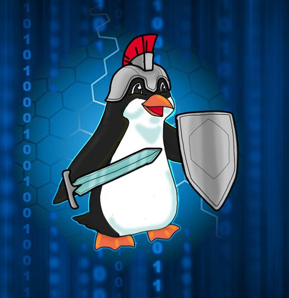

# Security | Linux | Quickstarts

## Resources
### Videos
- [Getting strategic about security | RedHat | YoutTube](https://www.youtube.com/watch?v=ZNoH4p66m78)
- [End-to-end OpenSCAP for automated compliance | RedHat | YouTube](https://www.youtube.com/watch?v=xmTt0MvyYQ8)
- [Ask Me Anything: Securing Containers, Hosts and Platforms | RedHat | YouTube](https://www.youtube.com/watch?v=5XdENRBgI7A)
- [Container security | RedHat | YouTube](https://www.youtube.com/watch?v=giFKMsIH4b0) (SECCOMP)
- [Understanding security risks and mitigation across the virtualization stack | RedHat | YouTube](https://www.youtube.com/watch?v=YJPar1OaTtk) (SECCOMP)
- [Super privileged containers - 2015 Red Hat Summit | RedHat | YouTube](https://www.youtube.com/watch?v=dM2Fc53Dtd4) (SECCOMP, SELinux)

## Credit
- [Linux Security | Infosec Images](https://wordpress.org/openverse/image/b5830c91-0013-4d64-b38a-3cb871a5687b)
