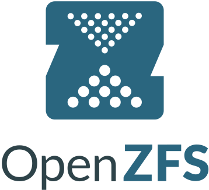

# OpenZFS

## RAID
### 0
- File blocks are shared between the drives
- When a file is read it is accessed by all the drives to get the file blocks at the same time
- Benefit: speed
- Practicle for: swap

> This can be configured with ZFS0

## :link: Resources
- [ZFS | Wikipedia](https://en.wikipedia.org/wiki/ZFS)
- [ZFS module | Ansible](https://docs.ansible.com/ansible/latest/collections/community/general/zfs_module.html)
- [RHEL-based distro | openzfs.github.io](https://openzfs.github.io/openzfs-docs/Getting%20Started/RHEL-based%20distro/index.html)
- [Chapter 2: ZFS Setup | docs.rockylinux.org](https://docs.rockylinux.org/books/lxd_server/02-zfs_setup/)
- [How to install and setup ZFS in Rocky Linux 9 | golinuxcloud.com](https://www.golinuxcloud.com/zfs-rocky-linux-9/)
- [ZFS on Linux](https://pve.proxmox.com/wiki/ZFS_on_Linux)
### RAID
- [RAID and RAIDZ | 45drives.com](https://www.45drives.com/community/articles/RAID-and-RAIDZ/)
- [RAID 0 vs. RAID 1](https://www.diffen.com/difference/RAID_0_vs_RAID_1)
## :copyright: Copyright
- [OpenZFS - logo](https://en.wikipedia.org/wiki/ZFS#/media/File:OpenZFS_logo.svg)
